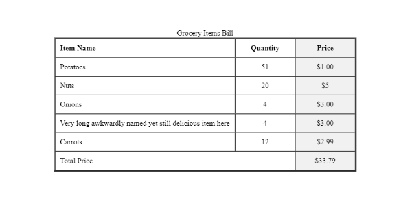

We can use tables to structure data in columns and rows. The table is the HTML way to layout the data. The CSS way to create layout in web page are [CSS float](https://taimoorsattar.dev/blogs/css-float), [flexbox](https://taimoorsattar.dev/blogs/CSS-flexbox) and [CSS grid](https://taimoorsattar.dev/blogs/CSS-grid).

We cover an example to understand how to create a table on the web page. You can view the HTML table example at the below codepen link:

👀 https://codepen.io/taimoorsattar/pen/NWpdwbp

For example, we can create a table in HTML for customer's grocery item bill as below:

```html
<table border="3" cellpadding="10" cellspacing="0">
  <caption>
    Grocery Items Bill
  </caption>
  <thead>
    <colgroup>
      <col width="60%" />
      <col width="20%" />
      <col width="20%" span="1" style="background-color:#f1f1f1;" />
    </colgroup>
    <tr>
      <th align="left" class="col-item-name">Item Name</th>
      <th align="center" class="col-quantity">Quantity</th>
      <th align="center" class="col-price">Price</th>
    </tr>
  </thead>
  <tbody>
    <tr>
      <td>Potatoes</td>
      <td align="center">51</td>
      <td align="center">$1.00</td>
    </tr>
    <tr>
      <td>Nuts</td>
      <td align="center">20</td>
      <td align="center">$5</td>
    </tr>
    <tr>
      <td>Onions</td>
      <td align="center">4</td>
      <td align="center">$3.00</td>
    </tr>
    <tr>
      <td charoff="1">
        Very long awkwardly named yet still delicious item here
      </td>
      <td align="center">4</td>
      <td align="center">$3.00</td>
    </tr>
    <tr>
      <td>Carrots</td>
      <td align="center">12</td>
      <td align="center">$2.99</td>
    </tr>
  </tbody>
  <tfoot>
    <td class="price_txt" scope="col" colspan="2">Total Price</td>
    <td align="center">$33.79</td>
  </tfoot>
</table>
```

The above code create a HTML table in the page (without CSS) as below:



To structure the HTML table, we have to use proper tags and attributes in the code. Some of the HTML tags that we can use in the table are described below.

| Sr# | Table HTML tags |                                        Description                                         |
| :-- | :-------------- | :----------------------------------------------------------------------------------------: |
| 1.  | `<caption>`     |  It define the caption of the table, must be inserted immediately after the `<table>` tag  |
| 2.  | `<thead>`       |                         It is used to group table header content.                          |
| 3.  | `<tbody>`       |          It is used to define table body, comprised of the blocks of table rows.           |
| 4.  | `<colgroup>`    | It is used to group multiple columns in the table, to assign a specific set of properties. |
| 5.  | `<th>`          |         It defines a cell in the table header (contains header label information)          |
| 6.  | `<tr>`          |                         It defines a row of cells in a table body.                         |
| 7.  | `<td>`          |         It defines a cell in the table body (contains the information of the data)         |
| 8.  | `<tfoot>`       |                   It is used to group footer content in the HTML table.                    |

Also, in the code, we use attribute to assign properties for the HTML table. Some of the attributes are describe as below.

| Sr# | HTML Table Attributes         |                        Description                         |
| :-- | :---------------------------- | :--------------------------------------------------------: |
| 1.  | scope="col"                   |       It is used identify the scope of header cell.        |
| 2.  | span="2"                      |         It is used to group the number of columns.         |
| 3.  | style="background-color:red;" | It is used to assign the CSS property to the HTML element. |
| 4.  | align="left"                  |              It is used to align the content.              |
| 5.  | width="60%"                   |      It is used to specify the width of HTML element.      |

## Style the HTML

To style the Grocery Items Bill table, we can use the below CSS.

```css
caption {
  font-size: 1.5rem;
  margin-bottom: 1.2rem;
}

table {
  table-layout: auto;
  border-spacing: 0; /*  Same as cellspacing="0" */
  border-collapse: collapse;
  width: 450px;
  margin: 40px auto;
}

table th,
table td {
  border: 1px solid black;
  vertical-align: top;
}

/* No need for this */
.col-item-name {
  width: 60%;
}

/* No need for this */
.col-quantity,
.col-price {
  width: 20%;
}

table th {
  background-color: #869960;
  color: #fff;
  text-shadow: 1px 1px 0 rgba(0, 0, 0, 0.4);
}

table tbody tr:nth-child(even) td {
  background-color: #dcdcdc;
}

.price_txt {
  text-align: right;
  font-weight: bold;
}
```

Rather than, using CSS to adjust the spacing of the table (e.g. [CSS box model](https://taimoorsattar.dev/blogs/box-model-in-css/)), we already specify it using HTML attributes.

> Note that due to compatibility issue, if some of the attribute is not supported, we can using CSS to style elements. In the above example, we use both CSS and HTML attributes to assign properties/styles to elements.

Also, in the above CSS, we use `nth-child` pseudo selector to target/style even table rows.
